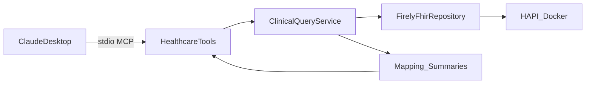

# FHIR MCP Server

> **Synthetic data only — not a medical device — not for clinical use.**
>
> - Patients are **Synthea-generated**; this repo contains **no real PHI**
> - **Not** a medical device; **not** for diagnosis, treatment, triage, or any clinical workflow
> - Educational / portfolio project only
> - Medication names come from local FHIR `MedicationRequest` records (synthetic) — **referential, not medical advice**. There is **no external drug API** in v1.

v1 read-only tools + grounding scorecard: a C#/.NET [MCP](https://modelcontextprotocol.io/) server that lets Claude query synthetic FHIR patients without speaking FHIR.

## Problem

Claude Desktop can orchestrate tools, but FHIR R4 JSON is noisy for models (codes, references, pagination). This server exposes a small **read-only** tool surface over local **HAPI FHIR** + **Synthea** data and returns clean text summaries — so the model stays grounded in tool output instead of inventing charts.

## Architecture



Raw FHIR never leaves the Mapping layer. Tools only orchestrate; Firely talks to HAPI.

## Stack

C# / .NET 10 · `ModelContextProtocol` 1.4.x (stdio) · Firely `Hl7.Fhir.R4` · HAPI FHIR (Docker) · Synthea · xUnit

## Quick start

**Prerequisites:** .NET SDK 10, Docker Compose, curl (and unzip). Node.js optional (MCP Inspector). Claude Desktop optional. **No Java** for the happy path.

Prefer `http://127.0.0.1:8080/fhir` over `localhost` (IPv6/`::1` can hang).

1. Start HAPI:

   ```bash
   docker compose up -d
   ```

2. Download prebuilt Synthea FHIR R4 sample (ZIP — no Java) and extract JSON into `data/sample-synthea-data/`:

   ```bash
   mkdir -p data/sample-synthea-data
   curl -L -o /tmp/synthea_fhir_r4.zip \
     "https://synthetichealth.github.io/synthea-sample-data/downloads/synthea_sample_data_fhir_r4_sep2019.zip"
   unzip -o /tmp/synthea_fhir_r4.zip -d /tmp/synthea_fhir_r4
   cp /tmp/synthea_fhir_r4/fhir/*.json data/sample-synthea-data/
   ```

   **Windows (PowerShell):**

   ```powershell
   New-Item -ItemType Directory -Force -Path data\sample-synthea-data | Out-Null
   curl.exe -L -o $env:TEMP\synthea_fhir_r4.zip `
     "https://synthetichealth.github.io/synthea-sample-data/downloads/synthea_sample_data_fhir_r4_sep2019.zip"
   Expand-Archive -Force $env:TEMP\synthea_fhir_r4.zip $env:TEMP\synthea_fhir_r4
   Copy-Item $env:TEMP\synthea_fhir_r4\fhir\*.json data\sample-synthea-data\
   ```

   Details and a Java generate alternative: [`data/README.md`](data/README.md).

3. Load a batched subset into HAPI (official sample ZIP has no hospital/practitioner bundles — the loaders skip those automatically):

   ```powershell
   powershell -ExecutionPolicy Bypass -File .\data\load-synthea.ps1
   ```

   ```bash
   chmod +x data/load-synthea.sh && ./data/load-synthea.sh
   ```

4. Smoke + unit tests:

   ```bash
   dotnet run -- --smoke Harris
   dotnet test fhir-mcp-server.Tests/fhir-mcp-server.Tests.csproj
   ```

5. MCP server (stdio) or Inspector:

   ```bash
   dotnet build
   npx @modelcontextprotocol/inspector dotnet exec bin/Debug/net10.0/fhir-mcp-server.dll
   ```

6. Claude Desktop (optional): absolute `dotnet` + dll paths and `env.Fhir__BaseUrl=http://127.0.0.1:8080/fhir`. Config: Windows `%APPDATA%\Claude\…`, macOS `~/Library/Application Support/Claude/…`, Linux `~/.config/Claude/…`.

## Demo

**Inspector (no Claude):**

```bash
npx @modelcontextprotocol/inspector --cli \
  dotnet exec bin/Debug/net10.0/fhir-mcp-server.dll \
  --method tools/list
```

Then call `search_patients` with a partial name (e.g. `Harris`), take a returned FHIR id, and call `get_patient_summary` / `get_conditions` / `get_medications`.

**Claude Desktop — try this:**

> Find patient Harris, summarize them, then list active conditions and current medications.

A strong demo run chains those tools without being told the steps. Grounding scorecard: [`evals/grounding-results.md`](evals/grounding-results.md). Also exercised with **Cursor** (Composer) and a local **Qwen2.5 7B** client via LM Studio — stdio MCP is client-agnostic, not Claude Desktop–specific.

## Safety

- All five MCP tools are **read-only** (`ReadOnly=true`, `Destructive=false`) — no clinical create/update/delete via MCP
- Responses are summarized text, never raw FHIR JSON
- Missing data returns an explicit "not found" — the server never fabricates
- Medications are display names from local HAPI/Synthea FHIR only — **not** clinical advice; no OpenFDA/DrugBank/RxNorm API in v1
- `data/load-synthea.ps1` and `data/load-synthea.sh` POST bundles into local HAPI for **dev setup only** — they are not part of the MCP tool surface

## Evals & grounding

Portfolio focus: **evals + human-in-the-loop**, not “the model is always right.”

Canonical scorecard: [`evals/grounding-results.md`](evals/grounding-results.md) (9 prompts).


| What we measure | What we do **not** claim |
| --- | --- |
| Claude’s answer stays inside what the MCP tools returned (grounding) | That FHIR→summary mapping is certified by these evals (that’s unit tests + smoke) |
| Routing quality (extra clean-fail probes vs inventing data) | Multi-run statistical significance |

**Close criteria:** Grounding **9/9** · Routing **≥7/9 ok** · labeled `Single run · model · date · N=9`.

**Human-in-the-loop:** grounding guarantees the data; interpretation can still drift (e.g. unsolicited drug inference, age arithmetic off by birth-year guessing). Review the prose, not only the tool JSON.

**Current scoreboard:** `Single run · model=Haiku · date=2026-07-18 · N=9` — Grounding **9/9** · Routing **8/9 ok** (1 noisy).

## Project layout

```
Fhir/          Firely client + repository
Mapping/       FHIR resources → clean summary text
Services/      ClinicalQueryService composition
Tools/         MCP tool wrappers (stdio)
data/          Load scripts + README (payloads gitignored)
evals/         Grounding scorecard
fhir-mcp-server.Tests/   xUnit unit tests
docker-compose.yml       HAPI FHIR on :8080
```

## License

[MIT](LICENSE)
